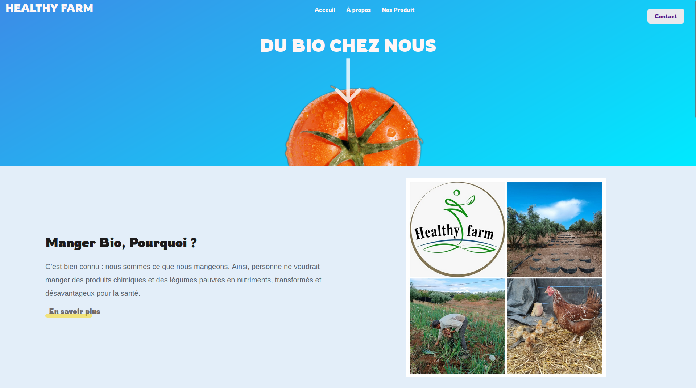

# Healthy Farm

# Organic Market Web Application (Version 2.0)

This project is an enhanced web application for selling organic vegetables, organic oil, eggs, and chicken meat. Users can explore products, place orders, and manage their accounts with features like login, signup, and logout, purchase products.

## Table of Contents

- [Features](#features)
- [Installation](#installation)
- [Usage](#usage)
- [Technologies](#technologies)
- [License](#license)

## Features

- Browse and search for organic products
- View detailed product information and pricing
- User authentication (login, signup, logout)
- Purchase products
- View countdown for arriving products
- REST APIs for backend functionalities

## Installation

1. Clone the repository: `git clone https://github.com/Oussa-Err/solid-spork.git`
2. Clone the repository: `git clone https://github.com/Oussa-Err/server-TSF.git`
3. Install the required dependencies: `npm install`

## Usage

1. Start the development server: `npm run dev`
2. Open your web browser and visit `http://localhost:5173`
2. Open your web browser and visit `http://localhost:8080`

## Technologies

1. Node.js: JavaScript runtime for server-side development
2. Express: Web application framework for Node.js
3. MongoDB: NoSQL database for data storage
4. React: JavaScript library for building user interfaces
5. Redux: State management for React applications
6. Vite: Fast build tool for web applications

## Contributing

Contributions are welcome! If you have any suggestions or find any issues, please create a new issue or submit a pull request.

### Suggested Contributions

1. **Bug Fixes**: Help identify and fix any existing bugs or issues in the codebase to improve stability and reliability.
2. **Feature Enhancements**: Propose and implement new features to enhance the functionality and user experience.
3. **UI/UX Improvements**: Assist in improving the visual design and user interface of the website for a better user experience.
4. **Code Refactoring**: Review and refactor the codebase to enhance readability, maintainability, and performance.
5. **Documentation**: Improve the project's documentation, including the README file, code comments, and additional guides.

## License

This project is licensed under the [MIT License](./LICENCE).
